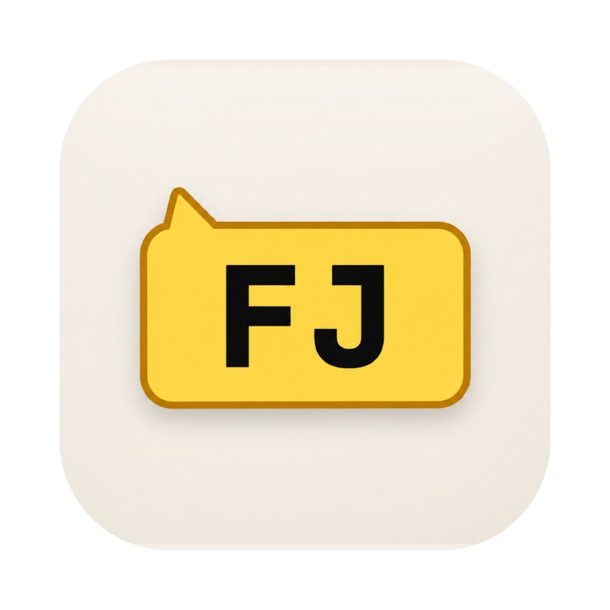
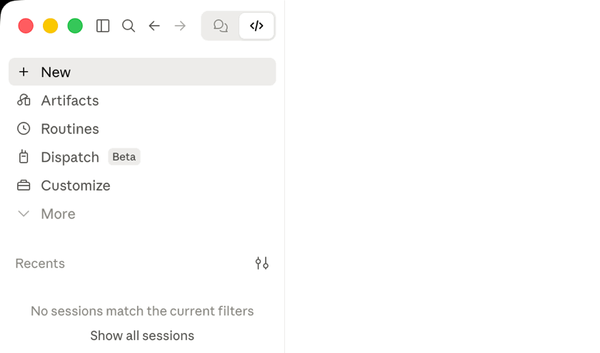

<p align="center">
  <a href="https://github.com/JeongJaeSoon/hintvim/releases"></a>
</p>

<h1 align="center">hintvim</h1>

<p align="center">
  <a href="https://github.com/JeongJaeSoon/hintvim/actions/workflows/ci.yml"></a>
</p>

**[Vimium](https://vimium.github.io/)-style keyboard hints for the [Claude desktop app](https://claude.ai/download).**

> Press `Ctrl+;`, type a label, and that button is pressed.

---

## What is hintvim?

hintvim is a small macOS menu bar app. Press `Ctrl+;` and every clickable thing in the Claude window gets a short label: the sidebar, the title bar, the model and mode menus, each message's buttons. Type the label and that element is pressed. No mouse.



```
Ctrl+;            →  labels appear on every button, link, and input
type "sf"         →  that element is pressed
j / k / d / u     →  scroll
Esc               →  leave
```

> hintvim is an unofficial community project. It is not affiliated with, endorsed by, or sponsored by Anthropic. "Claude" is a trademark of Anthropic, PBC.

## Why

Claude Desktop ships plenty of shortcuts (`Cmd+K`, `Cmd+1…9`, `Cmd+Shift+F`), but anything without a binding needs the mouse: the working-directory pill, the model and mode menus, per-message actions. Hint mode covers all of them at once, without a shortcut per control.

## Install

Requires macOS 13 or later and Claude Desktop.

```bash
brew install jeongjaesoon/tap/hintvim && hintvim setup
```

Then turn on **hintvim** in **System Settings → Privacy & Security → Accessibility**. macOS asks the first time the app starts. That's it: click into Claude and press `Ctrl+;`.

The formula builds the app from source on your Mac, so it needs no Developer ID and Gatekeeper does not stop it. Homebrew already requires the Command Line Tools this build uses.

### What `hintvim setup` changes

Setup is idempotent, logs each step to `~/Library/Logs/hintvim/setup.log`, and `hintvim uninstall` reverts all of it.

- Adds a login item, `~/Library/LaunchAgents/io.github.jeongjaesoon.hintvim.plist`, and starts the app. This is all `Ctrl+;` needs.
- Installs the optional **hintvim** Claude plugin: `claude plugin marketplace add JeongJaeSoon/hintvim` and `claude plugin install hintvim@hintvim`. It gives Desktop's Code tab the `/hintvim` command.
- **Only if** Claude Desktop bundles a Claude Code older than 2.1.287, adds `"CLAUDE_CODE_ENABLE_FUNCTION_HOOKS": "1"` to `env` in `~/.claude/settings.json`, after a backup. Older releases load plugin mods only behind this switch; from [2.1.287 they load by default](https://code.claude.com/docs/en/plugins/mods/overview#turn-mods-on-or-off) and ignore it. Setup records that it added the switch, removes it once Desktop is on 2.1.287 or later, and never touches a switch you set yourself.
- At each login the login item starts the app and re-checks the switch, because a Claude Desktop update replaces its bundled Claude Code.

To keep `~/.claude` untouched, run `hintvim setup --app-only`: you get `Ctrl+;` and the menu bar icon, without the plugin, the switch, or `/hintvim`.

### Install from Claude instead

If you start from Claude's plugin manager, add the marketplace and install the plugin (in a terminal, or **+ → Plugins → Add plugin** in Desktop's Code tab):

```bash
claude plugin marketplace add JeongJaeSoon/hintvim
claude plugin install hintvim@hintvim
```

Then, in a new Code session, run `/hintvim:setup`. Claude installs the app for you, with Homebrew if you have it or by building from source if you don't, and runs `hintvim setup`. The plugin alone can't do hint mode: [How it works](#how-it-works) explains why it needs the app.

## Use

Click into the Claude window and press `Ctrl+;`.

| Key | Action |
|---|---|
| `Ctrl+;` | Show or hide the labels. Claimed only while Claude is the frontmost app, so other apps keep the chord. |
| `a s f g q w e r t z x c v` | Type a label. The element is pressed, or focused if it's a text field. |
| `j` / `k` | Scroll down / up a little, then relabel |
| `d` / `u` | Scroll down / up half a page, then relabel |
| `Delete` | Undo one typed letter, or leave if nothing is typed |
| `Esc` | Leave |
| `Cmd` + anything | Leave, and the shortcut still works (`Cmd+Tab`, `Cmd+W`) |

While labels show, keys go to hintvim and never reach Claude, so nothing leaks into the prompt. Switching to another app ends hint mode. Labels follow the window when it moves or resizes. The window's close, minimize and full-screen buttons get no label, so a typo can't close the window.

Letters are read by physical position on a US (ANSI) layout, so labels work with a Korean or Japanese input source on. With Dvorak or AZERTY, type the key in the QWERTY position.

The menu bar icon (a keyboard) shows hints, shows whether Accessibility is allowed, and quits the app.

`Ctrl+;` and the menu bar need only the app. In a **Local** session of Desktop's Code tab (or in `claude` in a terminal), the plugin adds:

- `/hintvim`: the same as `Ctrl+;`. If the app is missing, it says how to install it.
- `/hintvim-palette`: a pane of six actions (copy the last reply, the last code block, the working directory or the session id; show context usage; compact). In Desktop you click them; their letter hotkeys only work in the terminal.
- `/hintvim:setup` and `/hintvim:doctor`: skills that install the app or find out why hints don't appear.

Desktop's prompt box prints `/hintvim isn't a command here.` under either command because it only knows built-in commands. The command still runs.

## Update

```bash
brew upgrade hintvim && hintvim setup
```

hintvim was called claude-vimium before 1.0.0. `brew upgrade` moves a claude-vimium install to hintvim, and `hintvim setup` then removes claude-vimium's login item, plugin, state and Accessibility entry.

Setup restarts the app so the new version runs. Because the app is signed on your Mac (ad hoc) rather than with a Developer ID, **macOS treats each upgraded build as a new app**: the old Accessibility entry still shows as on but no longer applies. Remove **hintvim** with **−** in the Accessibility list, then allow it again when asked. A signed and notarized build that keeps the permission across upgrades is tracked in [#4](https://github.com/JeongJaeSoon/hintvim/issues/4).

When Claude Desktop updates, nothing needs redoing. The app works on Desktop's window through macOS, the plugin stays installed in `~/.claude`, and the login item re-checks the mods switch.

## Uninstall

```bash
hintvim uninstall && brew uninstall hintvim
```

`uninstall` removes the login item, the plugin and its marketplace, the mods switch if setup added it, and the app's state and logs. It also tries `tccutil reset Accessibility` for the app. If that fails, it tells you to remove **hintvim** from the Accessibility list yourself.

## Troubleshooting

Run `hintvim doctor`, or `/hintvim:doctor` in a Code session. Doctor checks the app, the login item, the Accessibility permission, how many elements hint mode can see in Claude's window, the plugin, and the mods switch. Each failing line names its fix.

| Symptom | Fix |
|---|---|
| `Ctrl+;` shows nothing | Claude must be the frontmost app, with a window open: if you closed the window, click Claude in the Dock. Doctor then reports `hint targets: Claude Desktop has no window`. Making `Ctrl+;` reopen the window itself is tracked in [#14](https://github.com/JeongJaeSoon/hintvim/issues/14). If an input method is composing in the prompt box (an underlined character or a candidate list), press `Esc` first. Then run `hintvim doctor`. |
| Accessibility is on but nothing happens | The entry belongs to an older build. Remove it with **−**, then `hintvim stop && hintvim start` and allow it again. |
| `brew untap jeongjaesoon/tap` refuses | The tap holds other formulae you have installed. Leave it tapped; `brew uninstall hintvim` is enough. |
| `/hintvim` is unknown | The mod loads only in a session started after setup, and only in **Local** sessions. Start a new one. Still missing: `hintvim doctor` says whether mods can load. Anthropic can turn installed mods off remotely, and then `/hintvim` is gone until they turn them back on; `Ctrl+;` keeps working, since the app does not depend on the plugin. |

## Compatibility

| | Tested |
|---|---|
| macOS | 26.5 (Apple silicon). The app is built universal and targets macOS 13. |
| Claude Desktop | 2.7032.0, bundling Claude Code 2.1.280 (mods switch on) |
| Claude Code | 2.1.287 (terminal, mods on by default) |
| Input sources | US English, Korean |

Hint mode finds elements by their Accessibility roles, not by class names (the app's are hashed and change every release), so a Claude Desktop update rarely affects it. A large UI redesign could. Please [open an issue](https://github.com/JeongJaeSoon/hintvim/issues/new/choose) with the versions from `hintvim doctor` if labels stop appearing after an update.

## How it works

```
Claude Desktop ── Code session ──▶ hintvim plugin (a Claude Code mod)
                                      │ /hintvim → open hintvim://toggle
                                      ▼
Ctrl+; ──────────────────────────▶ hintvim app (menu bar, starts at login)
                                      │ macOS Accessibility API
                                      ▼
                         labels over the whole Claude window
```

A plugin alone can't do hint mode. Claude Code mods hook the Claude Code engine, not the window: they draw only in the engine's own places (panes, the band above the prompt, tool rows), so the app's sidebar and title bar are out of reach. A mod can't register a global key either. A `Button` hotkey is one letter, and only while the mod's own pane has the focus, and in Desktop clicking a pane doesn't take the keyboard from the prompt box.

macOS's Accessibility API can see the window. Asked through `AXManualAccessibility`, Chromium exposes the full tree of Claude's window, web content and chrome alike, and `AXPress` fires the same handlers a click would. So the work splits:

- **[`app/`](app)** is the menu bar app: a Carbon hotkey for `Ctrl+;`, an Accessibility walk over clickable roles clipped to visible scroll areas, a transparent panel that draws the labels, and an event tap that takes the keys while they show. It needs only the Accessibility permission, not Input Monitoring.
- **[`plugin/`](plugin)** is the optional mod. It reaches the app through the `hintvim://` URL scheme, which also starts the app if it isn't running.
- **[`bin/hintvim`](bin/hintvim)** sets up, checks, and removes everything around them.

### Why an app and not a Claude Code mod?

Mods were the first plan, and the plugin is one. But a mod can't do this job:

- It draws only inside the Claude Code engine's own surfaces, so the sidebar, the title bar and the model menu are out of reach.
- It can't register a global key, so there's no `Ctrl+;`.
- Anthropic can turn installed mods off remotely, and then `/hintvim` disappears.

Injecting a script into the window is closed too: the window renders remote claude.ai, the app is a hardened binary that refuses debuggers and injected libraries, and it quits when started with remote-debugging flags. The Accessibility API works from outside the app, so a Desktop update or a mods switch-off leaves `Ctrl+;` working.

## Without installing anything

A [DevTools snippet](docs/devtools-snippet.md) gives the same hint mode over the web page inside the window (not its sidebar or title bar), with a settings and help panel. It needs no permissions and nothing installed, but you run it again after each app restart. The page also explains why the snippet can't be installed into Claude Desktop permanently.

## Limitations

- macOS only.
- The leader key and the hint alphabet are fixed in the app. The DevTools snippet lets you change them.
- Each upgrade needs the Accessibility permission again, until there is a signed build ([#4](https://github.com/JeongJaeSoon/hintvim/issues/4)).
- The overlay drawing and key handling have no automated tests; they are verified by hand on a real Claude Desktop.

## Development

```bash
make test                                  # Node, shell and Swift unit tests
make app                                   # build/Hintvim.app (universal)
claude plugin validate plugin              # what the mod hooks and calls
claude plugin test plugin                  # plugin/hooks/register.test.tsx
```

`bin/hintvim` run from the repository uses `build/Hintvim.app`, and `HINTVIM_MARKETPLACE=$PWD bin/hintvim setup` installs the plugin from your checkout. Every rebuild is a new app to macOS, so allow Accessibility again after each one.

See [CONTRIBUTING.md](CONTRIBUTING.md) for the manual checks a change to the app needs, and [SECURITY.md](SECURITY.md) to report a vulnerability. `docs/superpowers/` holds the original design spec, plan, and research notes.

## License

[MIT](LICENSE)
